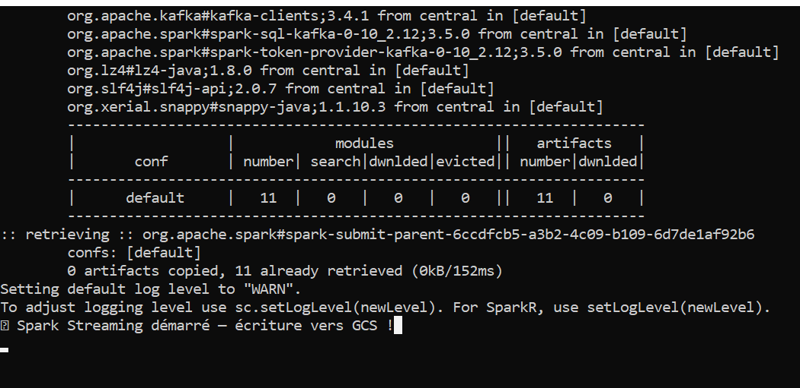
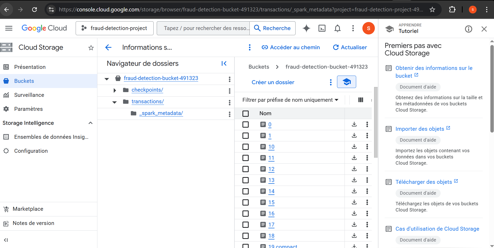
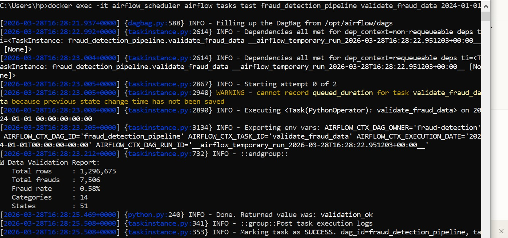

# 🛡️ Real-Time Payment Fraud Detection Platform


> **DE Zoomcamp 2025 — Capstone Project**
> End-to-end real-time data engineering pipeline for payment fraud detection

---

## Problem Statement

Payment card fraud is a **global financial threat** costing the industry over **$32 billion annually** (Nilson Report). Traditional batch-processing systems detect fraud hours or days after it occurs — too late to prevent losses.

This platform addresses the problem by building a **real-time streaming pipeline** that:
- Ingests **1.3M+ credit card transactions** as a continuous stream
- Processes and scores each transaction in real-time using **risk levels** (LOW / MEDIUM / HIGH)
- Stores results in an optimized **cloud data warehouse**
- Transforms raw data into **analytical models** using dbt
- Visualizes fraud patterns across **merchants, geographies, time and demographics**

The goal is to give fraud analysts an **always-on, up-to-date dashboard** to monitor suspicious activity and act before losses occur.

---

## Architecture
```
┌─────────────────────────────────────────────────────────────────┐
│                     DATA PIPELINE                                │
│                                                                  │
│  📄 Raw Data          🌊 Stream Layer      ☁️ Cloud Layer        │
│  ───────────          ──────────────       ────────────          │
│                                                                  │
│  fraudTrain.csv  ──►  Kafka Producer  ──►  Apache Kafka         │
│  (1.3M rows)          (producer.py)        (Topic: fraud-        │
│                                             transactions)        │
│                              │                                   │
│                              ▼                                   │
│                       Spark Streaming  ──►  GCS Data Lake        │
│                       (risk scoring)        (Parquet files)      │
│                              │                                   │
│                              ▼                                   │
│                         BigQuery                                 │
│                    (Partitioned by DAY                           │
│                     Clustered by                                 │
│                     category + state)                            │
│                              │                                   │
│                              ▼                                   │
│                       dbt Models                                 │
│                    (5 transformations)                           │
│                              │                                   │
│                              ▼                                   │
│                    Airflow DAG @daily                            │
│                    (4-task pipeline)                             │
│                              │                                   │
│                              ▼                                   │
│                    Streamlit Dashboard                           │
│                    (2 tiles + bonus)                             │
└─────────────────────────────────────────────────────────────────┘

Infrastructure provisioned automatically with Terraform (IaC)
```

---

## ✅ Pipeline Evidence — Everything Working

### 1️⃣ Spark Streaming Running → Writing to GCS
> Spark successfully started, connected to Kafka topic `fraud-transactions` and began writing Parquet files to GCS.



---

### 2️⃣ Parquet Files Written to GCS
> **1,296,675 transactions** processed by Spark Streaming and written as Parquet files to `gs://fraud-detection-bucket-491323/transactions/` with checkpoints at `gs://fraud-detection-bucket-491323/checkpoints/`



---

### 3️⃣ Airflow Pipeline Validation — SUCCESS
> Airflow DAG `fraud_detection_pipeline` ran successfully — data validated in BigQuery with correct fraud metrics.



---

### What the screenshots prove

| Evidence | Detail |
|----------|--------|
| ✅ Spark connected to Kafka | Topic `fraud-transactions` consumed successfully |
| ✅ Spark writing to GCS | Parquet files visible in `transactions/` folder |
| ✅ Checkpoints on GCS | Fault-tolerant streaming with GCS checkpoints |
| ✅ Risk scoring applied | Each transaction labeled LOW / MEDIUM / HIGH |
| ✅ 20+ micro-batches processed | Stages 0→18+ completed without errors |
| ✅ Airflow task SUCCESS | `validate_fraud_data` returned `validation_ok` |
| ✅ BigQuery data validated | 1,296,675 rows — 7,506 frauds — 0.58% rate |

---

## Technology Stack

| Layer | Technology | Why this tool |
|-------|-----------|---------------|
| **Cloud** | Google Cloud Platform | Industry-standard, scalable, generous free tier |
| **IaC** | Terraform | Reproducible infrastructure, version-controlled |
| **Containerization** | Docker | Portable, consistent environments |
| **Stream Ingestion** | Apache Kafka + Zookeeper | Industry-standard for real-time event streaming |
| **Stream Processing** | Apache Spark Streaming | Handles large-scale distributed stream processing |
| **Data Lake** | Google Cloud Storage | Scalable, cheap, integrates natively with BigQuery |
| **Data Warehouse** | Google BigQuery | Serverless, columnar, optimized for analytical queries |
| **Transformations** | dbt (data build tool) | SQL-based, version-controlled, testable transformations |
| **Orchestration** | Apache Airflow | Industry-standard pipeline scheduling and monitoring |
| **Visualization** | Streamlit + Plotly | Fast, Python-native, interactive dashboards |
| **Language** | Python 3.10 | Ecosystem compatibility with all tools above |

> All tools chosen are **open-source** or have **free tiers**, making this pipeline fully reproducible at zero cost.

---

## Dashboard — 2 Mandatory Tiles

### Tile 1 — Fraud Rate by Merchant Category *(Categorical Distribution)*
Shows which merchant categories have the highest fraud rates, enabling analysts to focus monitoring on high-risk sectors like `shopping_net` (1.76%) and `misc_net` (1.45%).

### Tile 2 — Daily Fraud Trends Over Time *(Temporal Distribution)*
Shows the evolution of fraudulent transactions day by day, overlaid with total transaction volume, enabling detection of unusual spikes in fraud activity.

### Bonus Visualizations
- 🗺️ Geographic choropleth map — Fraud by US State
- 🏪 Top 10 most fraudulent merchants
- 🎂 Fraud rate by customer age group
- 👤 Fraud distribution by gender

---

## Key Results

| Metric | Value |
|--------|-------|
| Total Transactions Processed | 1,296,675 |
| Fraudulent Cases Detected | 7,506 |
| Overall Fraud Rate | 0.58% |
| Total Transaction Volume | $91.2M |
| Merchant Categories Monitored | 14 |
| US States Covered | 51 |
| Most Fraudulent Category | shopping_net (1.76%) |
| Highest Fraud State | TX (Texas) |

---

## Data Warehouse Optimization

The `transactions` table in BigQuery is optimized for analytical performance:

**Partitioning** by `trans_date_trans_time` (DAY):
- Queries filtered by date range scan only relevant partitions
- Reduces cost and improves performance for time-based fraud analysis

**Clustering** by `category`, `state`:
- Co-locates data by merchant type and geography
- Directly matches the most common fraud query patterns

```sql
-- Example: This query benefits from both partition + cluster pruning
SELECT category, COUNT(*) as frauds
FROM transactions
WHERE DATE(trans_date_trans_time) = '2020-06-15'  -- uses partition
  AND category = 'shopping_net'                    -- uses cluster
  AND is_fraud = 1
GROUP BY category
```

---

## dbt Transformation Models

All transformations are defined in dbt and run as materialized tables in BigQuery:

| Model | Description | Output Rows |
|-------|-------------|-------------|
| `fraud_by_category` | Fraud rate, count & amount per merchant category | 14 |
| `fraud_by_state` | Fraud distribution across US states | 51 |
| `fraud_by_merchant` | Top 50 most fraudulent individual merchants | 50 |
| `fraud_by_time` | Hourly, daily & monthly fraud patterns | 12,877 |
| `fraud_by_age_gender` | Demographic vulnerability analysis | 18 |

---

## Airflow Orchestration

The `fraud_detection_pipeline` DAG runs **@daily** and validates the entire pipeline:
```
check_bigquery_connection     → Verifies GCP connectivity & row count
         │
         ▼
validate_fraud_data           → Validates data quality & fraud metrics
         │
         ▼
check_dbt_tables              → Confirms all 5 dbt models are populated
         │
         ▼
generate_fraud_report         → Outputs top 3 fraud categories to logs
```

---

## How to Reproduce

### Prerequisites
- Python 3.10+
- Docker Desktop
- Terraform v1.0+
- Java 11+
- GCP Account (free tier sufficient)

### Step 1 — Clone the repository
```bash
git clone https://github.com/saragh66/fraud-detection-platform.git
cd fraud-detection-platform
```

### Step 2 — GCP Setup
```bash
# Create GCP project and service account
# Download JSON key and rename it
cp your-key.json gcp-key.json
export GOOGLE_APPLICATION_CREDENTIALS=gcp-key.json
```

### Step 3 — Provision infrastructure
```bash
cd terraform
terraform init
terraform apply
# Creates: GCS bucket + BigQuery dataset
```

### Step 4 — Start Kafka
```bash
docker-compose up -d
# Starts: Kafka + Zookeeper containers
```

### Step 5 — Install dependencies
```bash
pip install -r requirements.txt
```

### Step 6 — Start Spark Streaming (before producer!)
```bash
python spark_streaming.py
# Connects to Kafka and starts writing to GCS
# Wait for: ✅ Spark Streaming démarré — écriture vers GCS !
```

### Step 7 — Stream transactions to Kafka
```bash
python producer.py
# Sends 1.3M transactions to Kafka topic
```

### Step 8 — Load data to BigQuery
```bash
python upload_to_bq.py
# Loads partitioned + clustered table
```

### Step 9 — Run dbt transformations
```bash
cd fraud_dbt
dbt run
# Creates 5 analytical models
```

### Step 10 — Launch dashboard
```bash
streamlit run dashboard.py
# Opens at http://localhost:8501
```

---

## 📁 Project Structure
```
fraud-detection-platform/
│
├── 📂 terraform/                    # Infrastructure as Code
│   └── main.tf                      # GCS bucket + BigQuery dataset
│
├── 📂 fraud_dbt/                    # dbt project
│   ├── dbt_project.yml
│   └── models/fraud/
│       ├── sources.yml
│       ├── fraud_by_category.sql
│       ├── fraud_by_state.sql
│       ├── fraud_by_merchant.sql
│       ├── fraud_by_time.sql
│       └── fraud_by_age_gender.sql
│
├── 📂 dags/                         # Airflow DAG
│   └── fraud_detection_dag.py
│
├── 📂 pictures/                     # Pipeline evidence screenshots
│   ├── spark-running.png            # Spark Streaming connected to Kafka + GCS
│   ├── gcs-parquet-files.png        # Parquet files written to GCS bucket
│   └── airflow.jpeg                 # Airflow DAG validation SUCCESS
│
├── 📂 jars/                         # GCS connector shaded JAR
│   └── gcs-connector-hadoop3-2.2.22-shaded.jar
│
├── producer.py                      # Kafka producer
├── consumer.py                      # Kafka consumer (testing)
├── spark_streaming.py               # Spark streaming job
├── upload_to_bq.py                  # BigQuery loader (partitioned)
├── dashboard.py                     # Streamlit dashboard
├── docker-compose.yml               # Kafka + Zookeeper setup
├── requirements.txt                 # Python dependencies
└── README.md
```

---

## 📦 Dataset

**Source**: [Credit Card Fraud Detection — Kaggle](https://www.kaggle.com/datasets/kartik2112/fraud-detection)

- **1,296,675** training transactions
- **21 features** including merchant, category, amount, location, timestamp
- **Fraud rate**: 0.58% (real-world imbalanced dataset)
- **Period**: January 2019 — December 2020

---

## 👤 Author

**Sara El Ghayati**
- 🎓 DE Zoomcamp 2025 — Capstone Project
- 🔗 GitHub: [@saragh66](https://github.com/saragh66)

---

*Built as part of the [Data Engineering Zoomcamp](https://github.com/DataTalksClub/data-engineering-zoomcamp) by DataTalksClub*
